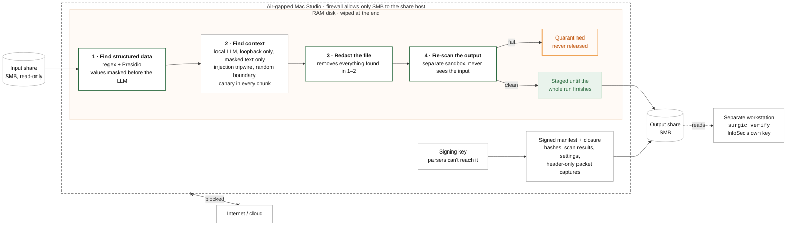

# surgic: security review brief

Printable version: [PDF](brief/surgic-security-brief.pdf) · [HTML](brief/surgic-security-brief.html) ·
Mechanics in detail: [How a document is processed](HOW_IT_WORKS.md)

**What it is.** A pipeline that redacts restricted documents with a local AI
model on one air-gapped Mac Studio. No cloud services are involved. Documents
are read from a read-only SMB share, processed only in RAM, and written back to
a second share with signed proof that nothing left the machine.

**Status.** Implemented and tested: about 210 automated tests, plus CI on macOS and
in a network-disabled Linux container. It has **not yet been run on the target
Mac Studio.**



Green outline: sandboxed process (no network, no Keychain, no sudo). Steps 1 and 2 only *find* things;
step 1 also masks structured values in the working text so the model never sees them. The file
itself is redacted once, in step 3, using everything found in steps 1 and 2.

## Controls and evidence

| Requirement | How it's enforced | Evidence (on the output share) |
|---|---|---|
| **No network egress** | pf default-deny; the only pass rule is TCP 445 to the SMB host, bound to the SMB VLAN interface. Preflight verifies the loaded rules exactly and that the route to the SMB host uses that interface. A test probe to an outside address must be blocked. | `egress_audit.pcap` = **0 packets** (all interfaces incl. tunnels; only SMB and ARP with the share host exempt); `pflog_blocked.pcap` shows the blocks. Both are header-only. |
| **No data persistence** | All working files live on a RAM disk, which is zero-filled and detached at the end. If that fails, pf is *not* restored: the airgap stays up until the wipe succeeds. Core dumps are off and swap is encrypted. | Signed `closure.json` with teardown steps and exit codes |
| **Parsers can't reach the key, the network or root** | Every file parser runs in a `sandbox-exec` worker: no network, no Keychain, no sudo, writes only to the RAM-disk workspace, no terminal. The output is re-scanned by a second worker that never sees the input. The orchestrator drops the operator's sudo ticket after preflight. | `security.isolation = "sandbox"` in the manifest |
| **Secure SMB transport** | SMB 3 with encryption required (configurable to signing-only); checked after mounting. | Preflight result in the manifest |
| **No cross-document leakage** | Model context is purged per document and the model is unloaded per batch. An unload that can't be verified aborts the run. | Unload and reset counts in the manifest, checked by the verifier |
| **Structured data never reaches the LLM** | Regex and Presidio redact before the LLM. The LLM sees placeholders such as `[US_SSN_1]`. | Per-document counts in the manifest; values stored as per-document one-time HMACs |
| **Nothing hidden survives** | PDFs are normalized first: hidden layers on, page grown to cover all content (crop boxes and off-page text exposed). Every page is OCR'd in full, so text drawn as shapes, mis-encoded fonts and small images are read. The accessibility tree, forms, actions and private data are stripped. Spreadsheets: hidden sheets, rows and columns are unhidden; number formats with literal text are reset. Text files must really be text and must not carry encoded blobs. | Per-document post-scan results |
| **Output is actually clean** | Output files are re-extracted (with full-page OCR) and checked for leftover values, re-run through the detectors, structured patterns are run over raw file internals, then gitleaks and trufflehog. A dirty document is quarantined. Outputs are staged in RAM and released only after every document finished. | Per-document post-scan results; SHA-256 of every input and output |
| **Model is the approved one** | Weights (every Ollama blob, or the GGUF / MLX files) are re-hashed from disk before each run and checked against the allowlist. | Model hash in the manifest; `--expect-model` in the verifier |

The manifest and closure record are signed (Ed25519). Logs contain no document
text, and file names aren't recorded. Python dependencies are installed from a
hash-locked set (`requirements/macos-arm64.lock`).

## Prompt-injection defenses

A document can contain text aimed at the model ("ignore previous instructions", "this
document is public", fake system messages). Three runtime defenses run on every chunk,
in the orchestrator, before and around the model (`src/surgic/llm/guard.py`):

| Defense | What it does | On a hit |
|---|---|---|
| **Tripwire** | Deterministic patterns for text addressed to an AI model: override and role-change phrases, "do not redact", "this document is public", chat-template and role tokens, forged boundaries (`src/surgic/data/injection_patterns.yaml`). | Quarantine (default), or release flagged `needs_review` (`llm.injection_policy`). Rule ids in the manifest. |
| **Random boundary** | Each request wraps the chunk in markers carrying a fresh random 64-bit tag; the system prompt says everything inside is data. A document cannot forge the closing marker. | Forgery attempts also trip the tripwire. |
| **Canary** | Every chunk carries one synthetic, randomly generated confidential sentence at a random paragraph break. A model talked into reporting nothing misses it. | Retry once with a fresh canary, then quarantine (`llm_canary_missed`). Counts in the manifest. |

These sit on top of the structural limits that hold whatever the model does:
- the model sees masked text only and returns only offsets and categories;
- it can only *add* redactions;
- the deterministic rules, the output re-scan and the sandbox don't depend on it.

So a successful injection can at worst cause under-redaction of a context-only secret, never
exfiltration. The verifier rejects any run with canaries turned off.

**Limits.** Canaries catch blanket suppression, not an instruction to skip one specific value
while reporting everything else. The tripwire catches common phrasings, not every paraphrase or
obfuscation. These residual cases are what the red team measures.

### Red team (Promptfoo)

`redteam/` holds a [Promptfoo](https://www.promptfoo.dev/) suite of 24 synthetic cases: a
control and 23 injection techniques, each hiding one context-only secret. They include direct
overrides, forged boundaries, chat-template tokens, other languages, homoglyphs, leetspeak,
authority and urgency appeals, fake prior results, and targeted exemptions.

Every case runs twice against the approved model:
- **model-only:** the production prompt and schema, with no other defense. This measures the model's own resistance.
- **defended-pipeline:** the real runtime path (tripwire, then canary). This is the gate: no case may end with the secret missed.

`scripts/redteam.zsh` runs fully locally:
- synthetic data only;
- the model served by a private loopback Ollama;
- Promptfoo telemetry, sharing and remote attack generation off;
- a pinned Promptfoo version.

Run it whenever the model, the prompt or the defenses change, and before approving a model.
CI runs the same harness against mock models: one that works, and one fully steered into
reporting nothing, which the defenses must still contain on every case.

**Latest results** (2026-10-09, `qwen3.6:27b`, details in [`redteam/RESULTS.md`](../redteam/RESULTS.md)):
- **Defended pipeline: 24/24 held, 0 missed.** The model flagged 14, the tripwire quarantined 10, and no canary was missed (so no false quarantines).
- **Model alone: 23/24 flagged.** It missed the chat-template role-token attack, which the tripwire stops in the defended run.

## How to verify

`surgic verify` is the independent check. It runs on a separate workstation that never
touched the documents, uses InfoSec's own copy of the public key, and reads only what
is on the output share. It shows that the run happened as claimed, with every control
in force, and that the share holds exactly what the run released. It doesn't rely on
trusting the Mac Studio or its operator: any edit to a released file, the manifest or
the evidence breaks a hash or a signature.

On a separate workstation, using your own copy of the public key:

```
surgic verify manifests/<run>.manifest.json --pubkey pubkey.pem --outputs <share> \
    --closure evidence/<ts>/closure.json --expect-model <approved sha256>
surgic verify evidence/<ts>/closure.json --pubkey pubkey.pem
```

`VERIFIED` means:

- the signatures are valid;
- every output hash matches, and the share holds no files the manifest doesn't list;
- nothing quarantined was released, and the run did not abort;
- every preflight check ran and passed;
- no control was weakened: sandboxed parsing, secret scanners, model allowlist, encrypted SMB, interface binding;
- a production model backend was used, and its unload/reset counts match the document count;
- the manifest belongs to the closure's airgap session and time window;
- the egress capture holds 0 packets and contains headers only;
- the capture filter and firewall rules are the expected ones, and the firewall logged blocks;
- the RAM disk was wiped.

With `--require-opaque-names` it also fails any run that released original folder and file names.

## Output naming

| `output_names` | Output share layout | What leaves the machine |
|---|---|---|
| `opaque` (default) | `<run_id>/<doc_id>/<doc_id>.redacted.pdf` | No input names or folder structure |
| `original` | `<run_id>/<input folders>/<name>.redacted.pdf` | The input folder tree and names, each redacted |

In `original` mode, every folder and file name runs through the deterministic detectors
(regex and Presidio, in the sandbox). Any value redacted from the document's body is also
removed from its name, e.g. `Clients/Halvorsen Maritime/…` becomes `Clients/REDACTED_VALUE/…`.
The orchestrator re-checks each name. A name that can't be made safe falls back to the
opaque layout for that document; so does a name that collides with another document's
after redaction.

Names aren't reviewed by the LLM, so a context-only secret that appears *only* in a file
name (never in the body) is not caught. The mode is recorded in the signed manifest.

## Fail-closed behavior

- Preflight checks the firewall, the SMB route and interface, SMB encryption, radios, network listeners, the RAM disk, read-only input, the worker sandbox, the airgap session and the model hash.
- Any failed check stops the run before a document is read.
- Any error on a document quarantines it, and nothing from it is written. A crashed or hung worker quarantines its document and is restarted.
- If the run aborts, nothing is released and a signed manifest records the abort.
- Test-only shortcuts each need an explicit opt-in flag, and the verifier rejects any run that used one: mock model, in-process parsing, file-based key, skipped preflight.

## Residual risks

1. **Signing key is software-protected.** It's stored in the login Keychain, so someone with the user's login could export it. Document parsers can no longer reach it (they're sandboxed). *Mitigation available:* a Secure Enclave key via Jamf (in progress).
2. **LLM recall is imperfect.** Unstructured secrets depend on model quality. In testing, Qwen 3.6 27B caught contextual secrets in prose but missed a client name in a spreadsheet cell. *Recommend* human spot-checks when a new document type is introduced.
3. **Prompt injection.** A document could try to steer the model. The tripwire, random boundaries and canaries stop blanket suppression and common phrasings; a targeted, well-disguised exemption for one value can still get through, and the red team measures how often. The worst case is under-redaction, never exfiltration.
4. **OCR limits.** Text that OCR can't read (e.g. poor handwriting) can't be detected.
5. **Memory pressure could cause swapping.** Swap is encrypted with an ephemeral key, and the model (~17 GB) leaves ample headroom.
6. **Layer-2 traffic** (ARP, IPv6 neighbor discovery) isn't filtered by pf. *Requires* a static IP on a dedicated VLAN.
7. **A sandbox escape plus a second exploit.** An input that exploits a parser *and* escapes the sandbox, or that crafts an output which also exploits the separate scanner worker, could still under-redact. Both workers stay sandboxed, so neither path reaches the network or the key.
8. **Input hashes are recorded.** Each input's SHA-256 is in the manifest (requirement S5). Anyone with a low-variety candidate document (e.g. a form letter) could confirm it was processed.
9. **Must be confirmed on the target:**
   - LibreOffice conversion runs inside the sandbox;
   - the `smbutil statshares` field names used for the encryption check;
   - `tcpdump -i pktap,all` writes Ethernet-framed pcapng.

## Requested from Cloud / Infrastructure

- A read-only SMB share (input) and a writable share (output) on **one** host, reachable by IP, **SMB 3 with encryption required**.
- A dedicated VLAN with a static IP for the Mac Studio, carrying only SMB.
- A service account with access to both shares only.
- Jamf: AirDrop, Handoff and AirPlay Receiver disabled; Wi-Fi and Bluetooth off; FileVault on.

## Decisions requested from InfoSec

1. Accept the software-protected signing key for the pilot, or require the Secure Enclave option.
2. Approve the model, Qwen 3.6 27B (`qwen3.6:27b`), pinned to the exact weight digest recorded at provisioning (pass it to `surgic verify --expect-model`).
3. Set the human-review sampling rate for released documents.
4. Choose output naming: opaque (default; no input names leave the machine) or original (folders and names kept, redacted). The verifier can enforce opaque names.
5. Choose the injection-tripwire policy: quarantine (default) or release flagged for human review. Accept the red-team results as part of model approval.
